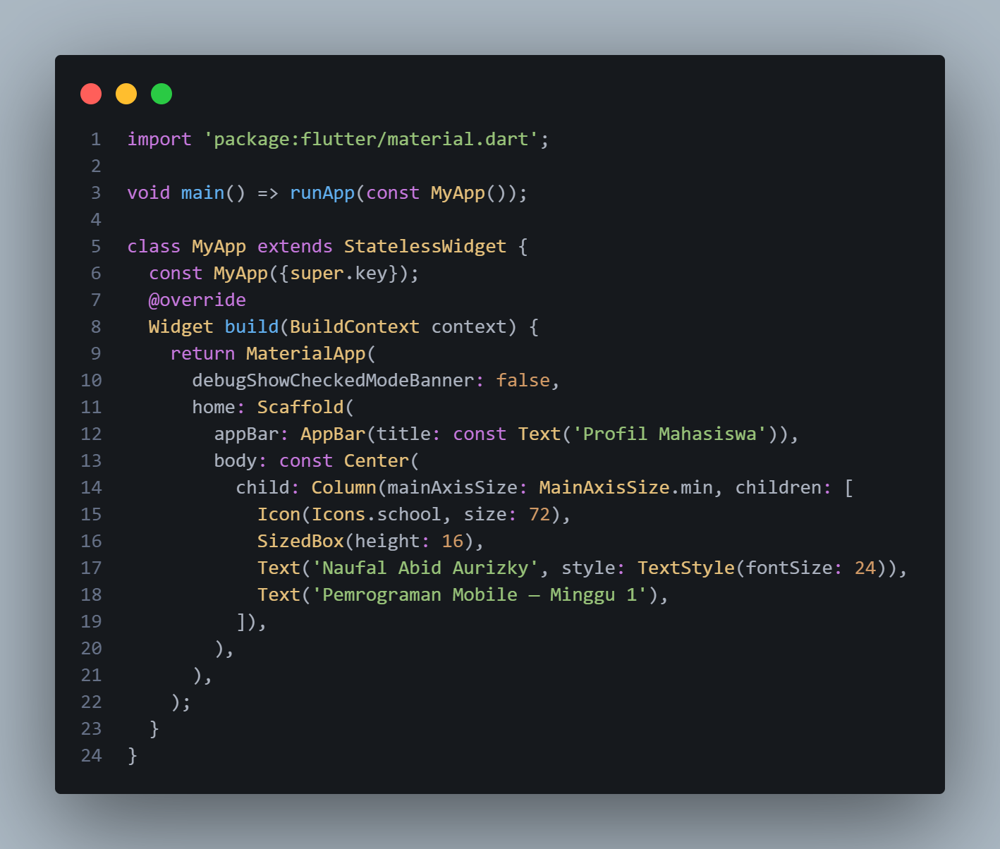

|  | Pemrograman Mobile |
|--|--|
| NIM |  244107020212|
| Nama |  Naufal Abid Aurizky |
| Kelas | TI - 3G |
| Repository | [link] (https://github.com/Abidau/244107020212-mobile-course/tree/main/01-week-1-mobile-development-ecosystem-flutter-refresh) |

## Menyiapkan environment

### Instalasi Flutter

Langkah pertama yang dilakukan adalah menyiapkan Fultter sebagai framework pengembangan aplikasi. Setelah flutter terpasang, perlu dilakukan pengecekan untuk memastikan Flutter dapat digunakan melalu Command Prompt


Pada perintah tersebut digunakan untuk mengetahui versi flutter yang terpasang pada komputer, jika flutter telah terpasang dengan benar, Command Prompt akan menampilkan informasai tentang versi Flutter, Dart, dan komponen terkait

### Verifikasi Environment

Setelah melakukan instalasi, dapat dilakukan pengecekan environment pada berikut ini


Perintah tersebut digunakan untuk memeriksa sebuah komponen yang dibutuhkan untuk pengembangan Flutter apakah sudah tersedia atau tidak

### Konfigurasi Lisensi Android SDK


Perintah ini digunakan untuk menerima persyaratan lisensi komponen Android SDK yang diperlukan dalam pengembangan aplikasi Android menggunakan Flutter. Dan setelah lisensi tersebut diterima, konfigurasi diverifikasi kembali menggunakan perintah flutter doctor

### Memastikan Perangkat Terbaca Flutter

Menggunakan USB Debugging aktif dan HP terhubung menggunakan kabel USB, dilakukan pengecekan dengan perintah berikut ini


Perintah tersebut digunakan untuk memastikan perangkat yang digunakan Flutter sebagai target aplikasi. Jika HP berhasil terdeteksi, perangkat Android akan muncul pada daftar perangkat

## Praktikum : Aplikasi Flutter Pertama

### Membuat Project Flutter

Project Flutter pertama dibuat menggunakan perintah berikut ini


Perintah tersebut secara otomatis membuat struktur project Flutter dan setelah prosese selesai, terbentuk folder "my_first_app" yang didalamnya terdapat berbagai folder dan file yang dibutuhkan untuk Flutter

### Menjalankan Project Flutter

Setelah berhasil dibuat, project dapat dijalankan menggunakan perintah berikut ini


Flutter akan mencari perangkat yang tersedia, karena Android telah terhubung menggunakan USB dan USB Debugging telah diaktifkan, aplikasi dapat dijalankan langsung pada HP. 

### Mengubah UI default



Kode tersebut digunakan untuk mengubah UI default menjadi UI yang sudah ada pada praktikum dan berikut adalah hasil perubahan UI nya


Setelah main.dart diubah dan aplikasi dijalankan kembali pada HP, tampilan aplikasi berubah dari aplikasi bawaan Flutter menjadi aplikasi profil mahasiswa seperti hasil UI diatas

## Verifikasi dan Tugas

### Perbedaan Hot Reload dan Hot Restart

- Pada Hot Reload memasukkan kode baru ke aplikasi yang sedang jalan tanpa menghilangkan posisi atau data saat itu. Contohnya seperti mengubah teks

    ```
    Text("Nama Anda")
    ```

    menjadi

    ```
    Text("Naufal Abid Aurizky")
    ```

- Pada Hot Restart akan menjalankan ulang seluruh aplikasi dari awal dan menghapus semua data atau posisi yang sedang berjalan

### Mini Assignment

#### Tugas

Membuat aplikasi Profile Mahasiswa berdasarkan praktikum untuk menambahkan NIM dan satu informasi tambahan menggunakan widget dasar

Kode :


Hasil :


#### Kendala
Pada Kendala saat melakukan setup perangkat Android, terdapat kendala memastikan perangkat fisik terhubung dan terdeteksi oleh Flutter, dan cara untuk menyelesaikan kendala tersebut adalah menggunakan kabel USB dan memastikan pengaturan yang diperlukan pada perangkat telah diaktifkan. Dengan melakukan tersebut, pengecekan menggunakan perintah "flutter devices" untuk memastikan perangkat dapat dikenali flutter

### Refleksi

1. Kapan native lebih tepat dipilih daripada cross-platform?

    Jawaban : 
    Native dipilih ketika aplikasi tersebut membutuhkan peforma tinggi, akses mendalam ke fitur perangkat, Sedangkan cross-platform lebih seesuai jika Flutter tersebut hanya mengembangkan aplikasi untuk platform dengan satu basis kode saja

2. Bagaimana perubahan state berhubungan dengan widget tree dan UI deklaratif?

    Jawaban :
    Perubahan state akan menyebabkan Flutter membangun kembali bagian widget tree yang berkaitan dengan perubahan tersebut, yang akan menampilkan UI menyesuaikan secara otomatis. Jadi, dengan konsep UI deklaratif yaitu developer menentukan seperti apa tampilan berdasarkan kondisi atau state saat itu juga

3. Mengapa commit kecil dengan pesan jelas bermanfaat bagi pekerjaan tim dan portfolio?

    Jawaban :
    Commit kecil dengan pesan yang jelas membuat perubahan lebih mudah dipahami, dilacak, dan diperbaiki. Dalam kerja tim, hal tersebut memudahkan anggota lain mengetahui perkembangan pekerjaan, sedangkan untuk potfolio menunjukkan proses pengembangan dilakukan secara terstruktur dan profesional 