|  | Pemrograman Mobile |
|--|--|
| NIM |  244107020212|
| Nama |  Naufal Abid Aurizky |
| Kelas | TI - 3G |

## Instalasi

Menginstall flutter sesuai arahan praktikum 1

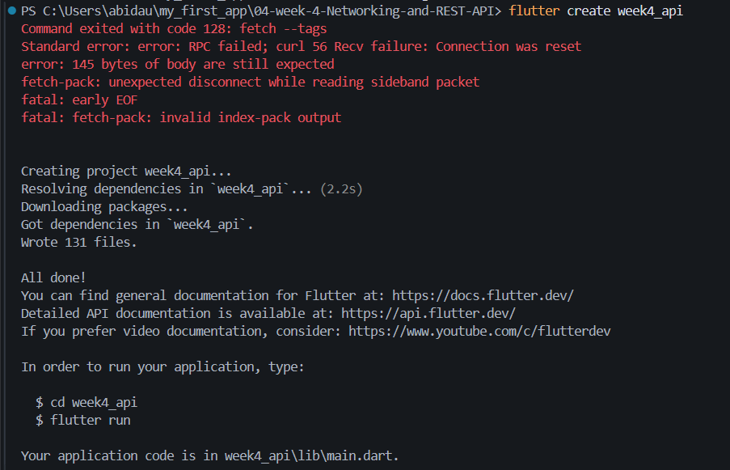

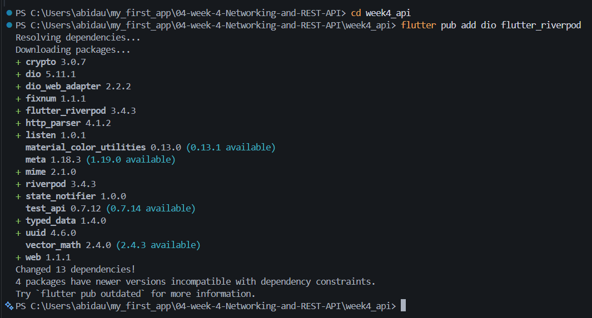

## Hasil dari praktikum

- Infinite Scroll

Aplikasi berhasil menampilkan data postingan dari API sebanyak 10 data setiap halaman. Data berikutnya akan dimuat secara otomatis saat pengguna melakukan scroll ke bawah tanpa terjadi data duplikat atau request berulang.

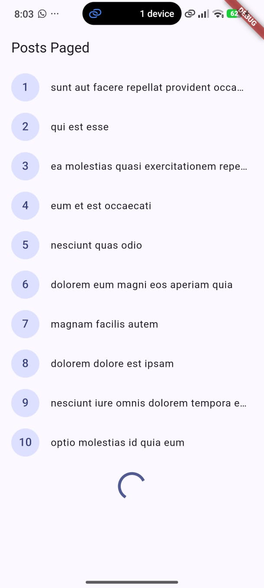

- Penanganan 4 state UI

| Internet Normal | Internet Mati |
|:---:|:---:|
| 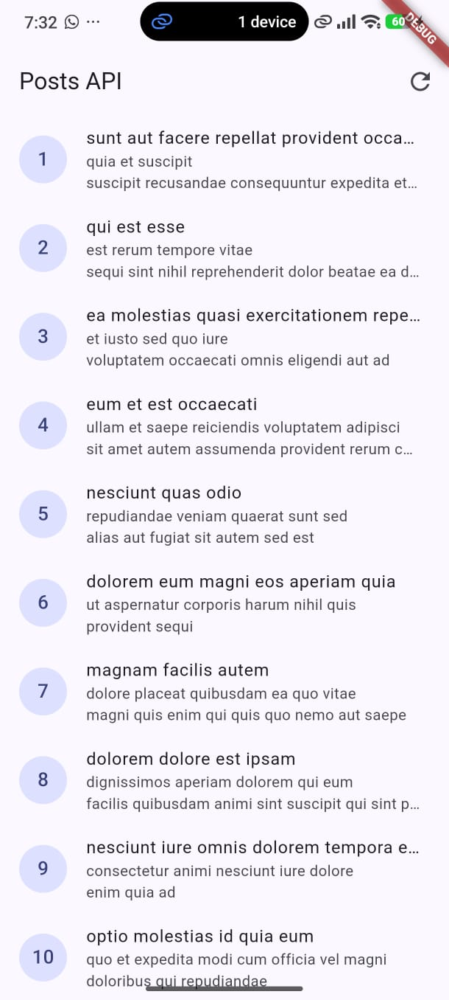 | 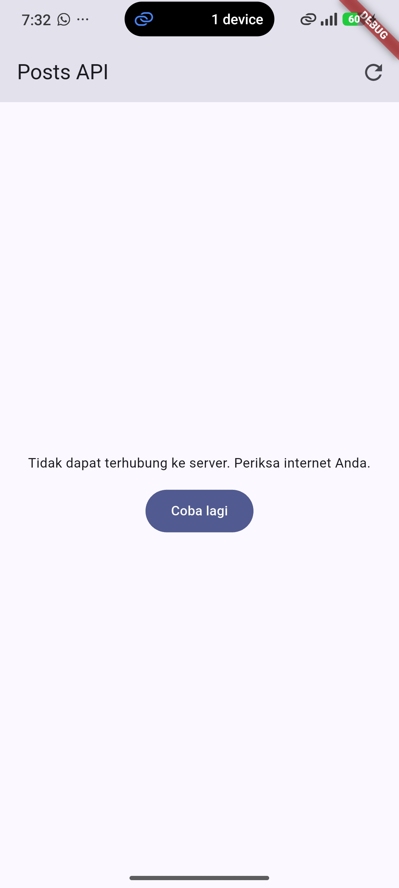 |

## AI Challenge

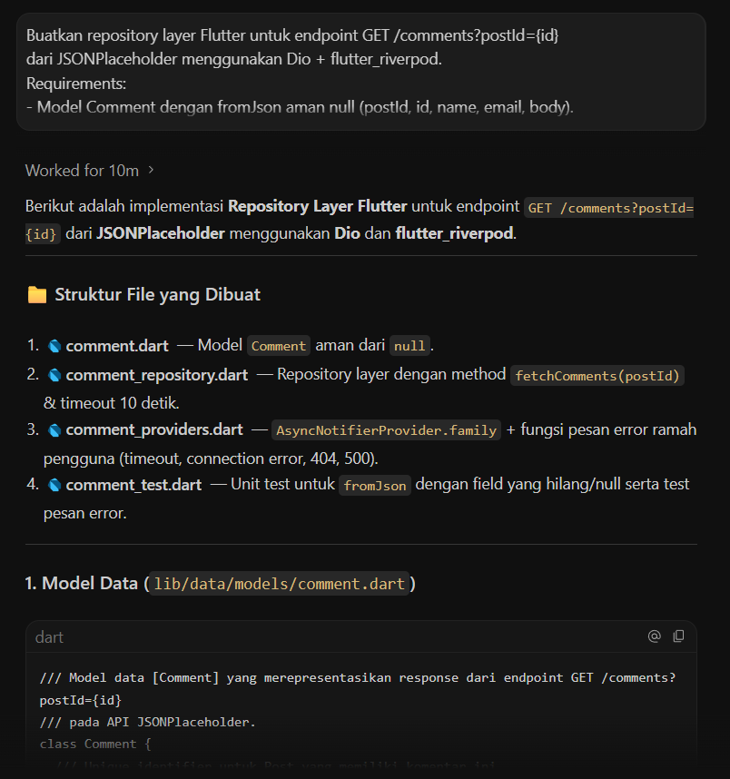

1. 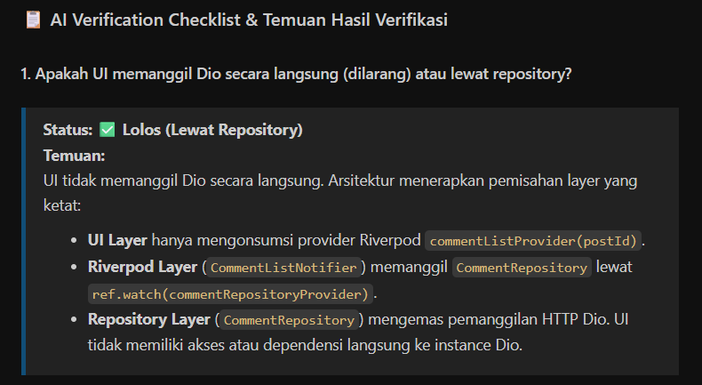

2. 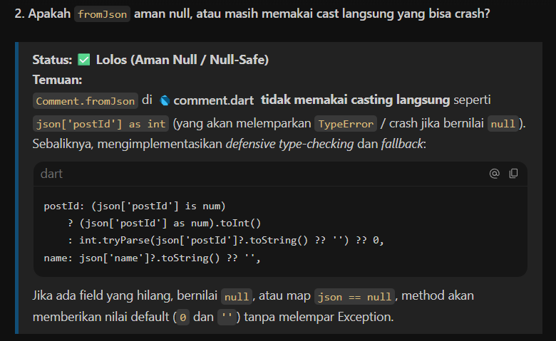

3. 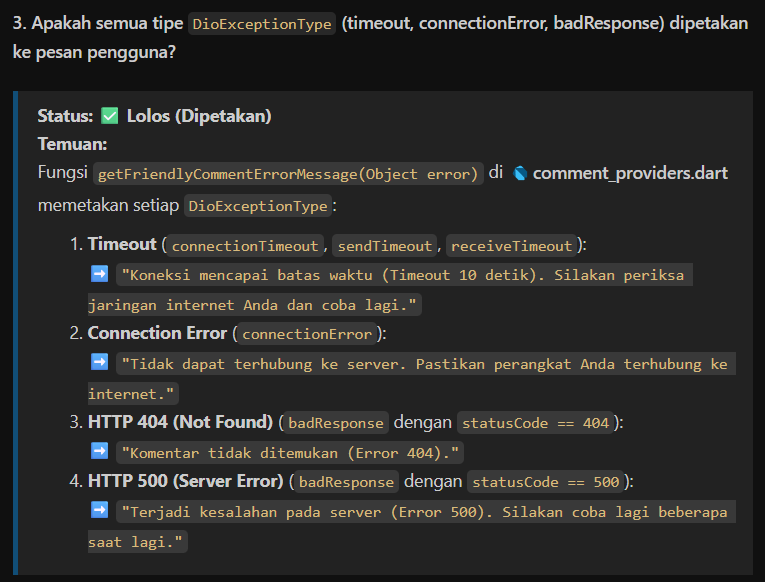

4. 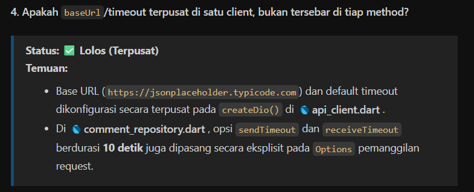

5. 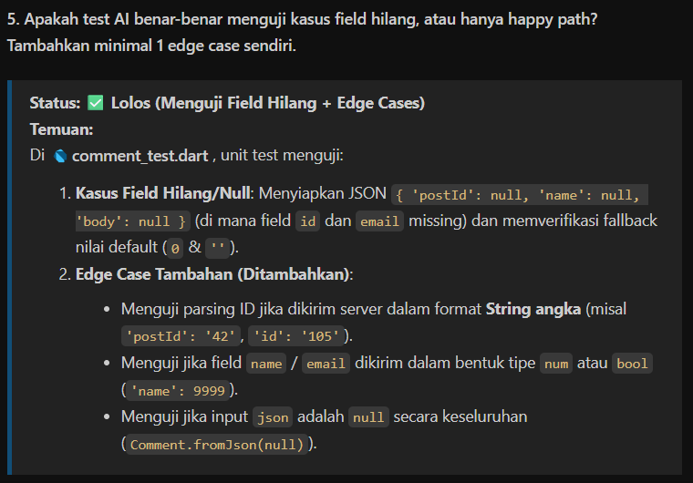

6. Hasil dari `flutter analyze` dan `flutter test`

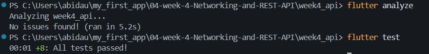

## Refleksi

1. UI yang hanya bertanggung jawab menampilkan state dan merespon interaksi pengguna, bukan sebagai bagaimana data diambil. Dio adalah detail implementasi jaringan, jika widget memanggil langsung maka beberapa hal sebagai berikut yang rusak:

- Logika terbesar di banyak tempat, pada JSON, penanganan timeout dan pemetaan error harus ditulis ulang di setiap widget yang membutuhkan data, begitupula jika ada perubahan endpoint atau format response, semua widget harus diubah satu satu

- Sulit di test, widget test seharusnya menguji tampilan seperti loading, data, error bukan benar benar melakukan HTTP request ke server sungguhan, jika Dio dipanggil langsung di widget maka cara mengetes adalah lewat jaringan asli atau membongkar widget tersebut, repository yang terpisah bisa di mock dengan mudah

- Tidak ada satu sumber kebenaran atau single source of truth untuk error handling, contoh dari sesi pemetaan pesan error ramah ada di satu tempat di commentrepository atau postrepository. Jika logika ini ada di widget, maka tiap halaman bisa punya error yang berbeda atau lupa menangani salah satu kasusnya

- Sulit menambahkan fitur lintar-request seperti caching, retry otomatis, atau interceptor autentikasi dikarenakan tidak ada lapisan tengah yang bisa membungkus satu kali untuk semua request

- Coupling ke library tertentu jika nanti pindah dari Dio ke HTTP package atau ke GraphQl client, maka seluruh widget yang memanggil Dio langsung harus diubah, dengan repository sebagai lapisan abstraksi hanya isi repository yang berubah, kontrak (method fetchX(), model yang dikembalikan) tetap sama

2. Pagination client-side cukup ketika:

- Total data kecil dan realistis untuk dimuat sekaligus (misalnya puluhan hingga beberapa ratus item), sehingga mengambil semuanya sekali lalu memotong-motong tampilannya di UI tidak membebani memori atau jaringan secara signifikan.

- Data sudah tersedia secara lokal (hasil cache, database lokal, atau file), jadi tidak ada biaya tambahan memanggil server berulang kali.

- Dibutuhkan operasi seperti sorting/filtering kompleks yang lebih mudah dilakukan di sisi client setelah semua data ada, dan API tidak mendukung filter tersebut di server.

Harus pakai pagination server (_page/_limit dsb.) ketika:

- Jumlah data besar atau tidak terbatas (feed sosial media, daftar produk e-commerce), memuat semuanya sekaligus tidak realistis dari sisi memori perangkat maupun kuota data pengguna.

- Ingin performa awal (initial load) cepat, user tidak perlu menunggu seluruh dataset selesai diunduh hanya untuk melihat 10 item pertama.

- Data bisa berubah/bertambah terus-menerus di server (real-time feed), sehingga "mengambil semua lalu potong" tidak akurat lagi setelah beberapa saat.

- Server memang sudah menyediakan parameter pagination resmi (seperti _page & _limit di JSONPlaceholder), tidak memanfaatkannya berarti membuang efisiensi yang sudah disediakan API, dan berisiko salah kirim parameter (seperti yang sempat kita curigai: apakah nama parameternya page/limit atau _page/_limit) sehingga server mengembalikan data yang tidak sesuai harapan.

3. otomatisasi AsyncError berlaku untuk alur utama build() provider, begitu ada logika kustom di luar build() yang memanipulasi state secara manual, atau butuh penanganan error yang tidak sekadar "jadi AsyncError", try/catch eksplisit tetap wajib.

4. Selama sesi ini, ada beberapa bagian hasil AI awal yang saya (sebagai pengguna, dibantu diagnosis oleh AI) telusuri dan perbaiki:

- paged_post_page.dart — penanganan error yang tidak lengkap. Kode awal hanya menampilkan pesan error ketika state.items.isEmpty. Ini bug nyata: begitu halaman pertama berhasil (10 item tampil) tapi halaman berikutnya gagal, kondisi itu tidak pernah terpenuhi, sehingga UI tetap menunjukkan CircularProgressIndicator selamanya alih-alih pesan error yang jelas. Saya perbaiki dengan menambahkan cabang error di footer ListView (tampil ketika state.error != null, lengkap dengan tombol "Coba lagi"), supaya error di halaman mana pun (bukan cuma halaman pertama) tetap terlihat oleh pengguna.

- Listener scroll tanpa guard di level UI. Listener _onScroll awalnya memanggil loadNextPage() setiap kali posisi scroll memenuhi syarat, tanpa mengecek dulu status terbaru dari provider. Meski PagedPostsNotifier.loadNextPage() sebenarnya sudah punya guard sendiri (isLoadingMore || !hasMore), saya tetap menambahkan pengecekan di level widget (termasuk error != null) sebagai lapisan pertahanan kedua, supaya tidak ada percobaan auto-retry berulang ke server yang sedang bermasalah.

- Kesalahan penamaan field saat pertama kali menulis fix. Saya sempat memakai state.isLoading padahal field yang sebenarnya ada di PagedPostsState adalah isLoadingMore. Setelah melihat kode asli paged_posts.dart, saya koreksi nama field tersebut supaya kode benar-benar bisa di-compile dan sesuai dengan struktur state yang sudah ada.

- Pesan error yang awalnya teknis menjadi ramah pengguna. Pada CommentRepository, alih-alih membiarkan DioException mentah sampai ke UI, ditambahkan fungsi pemetaan (_friendlyMessageFor) yang menerjemahkan setiap jenis error Dio (timeout, connection error, 404, 500, dll.) menjadi kalimat berbahasa Indonesia yang bisa langsung ditampilkan ke pengguna tanpa istilah teknis.