|  | Pemrograman Mobile |
|--|--|
| NIM |  244107020212|
| Nama |  Naufal Abid Aurizky |
| Kelas | TI - 3G |

## Praktikum 1 - SharedPreferences

Menyiapkan project

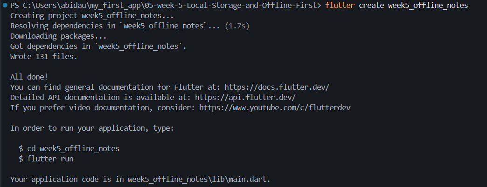

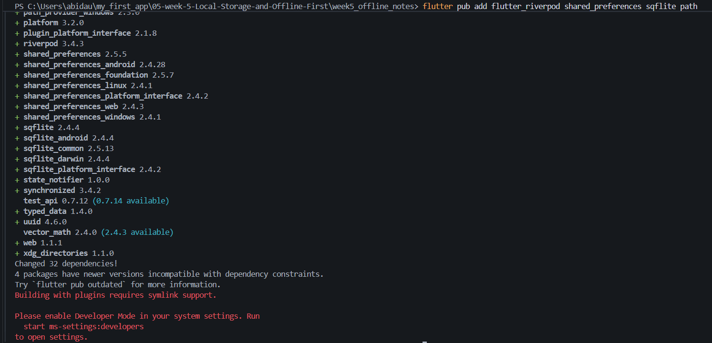

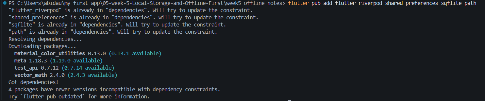

## Praktikum 2 0 SQLite dan repository catatan & Praktikum 3 - Cache-first dan antrean sync

| Saat Offline | Memasukkan Catatan | Tidak bisa disingkronkan | Mode Online |
|:---:|:---:|:---:|:---:|
| 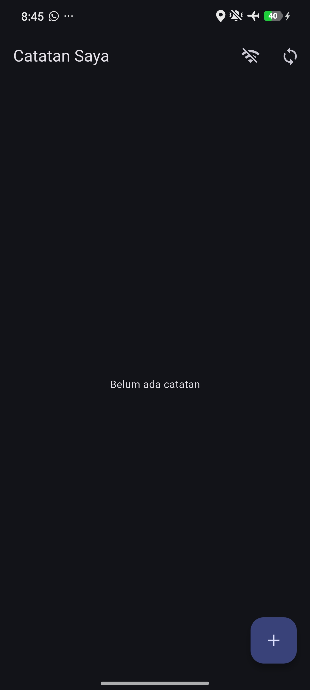 | 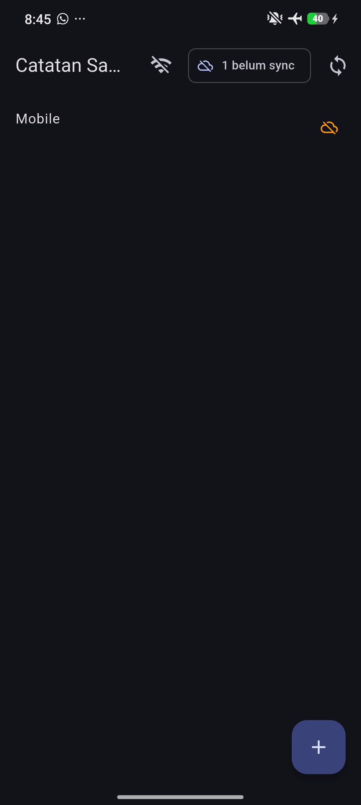 | 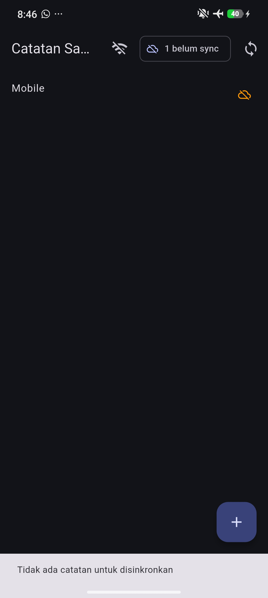 | 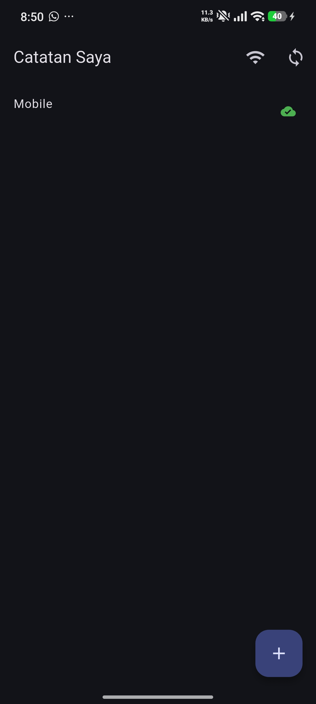 |

## AI Challenge

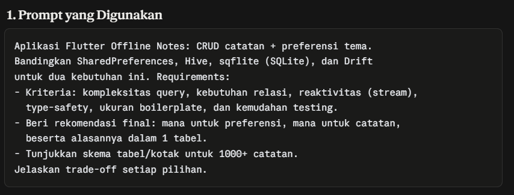

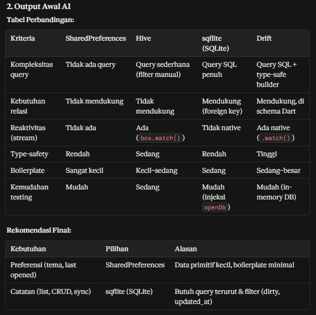

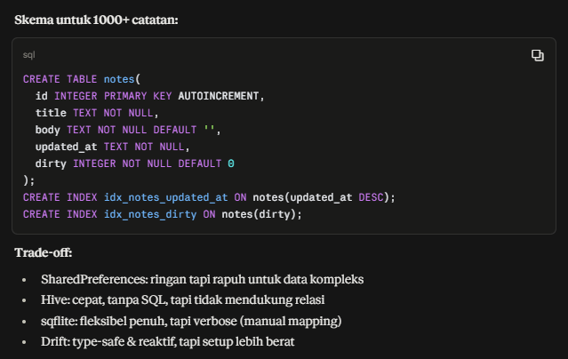

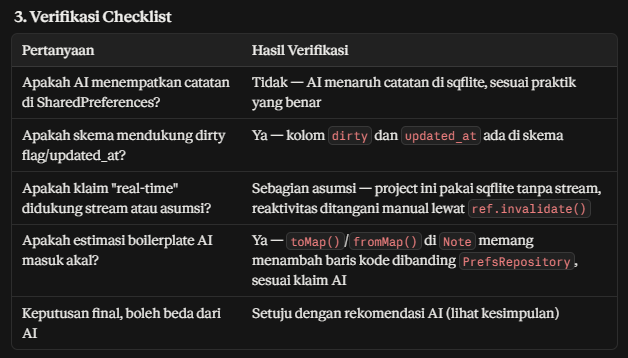

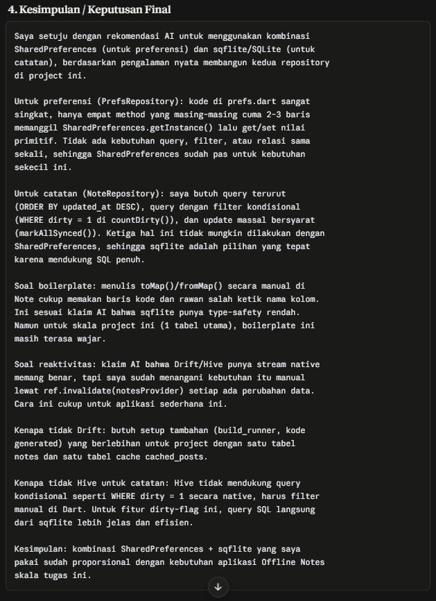

## testing

#### Before

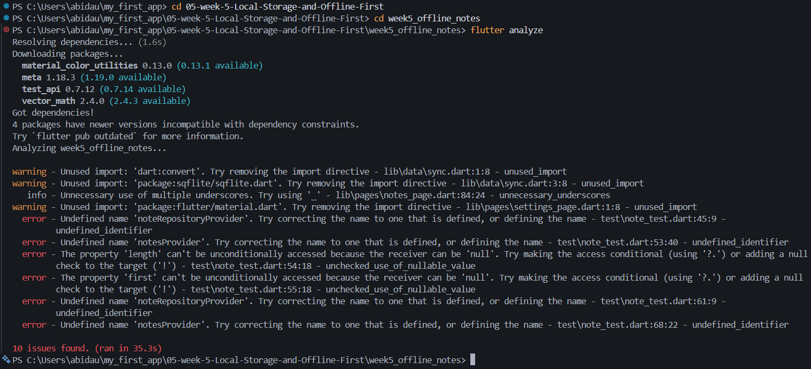

#### After

Agar tidak terjadi error saya merubah kode pada `note_test.dart` menambahkan Import Provider seperti berikut ini

```
import 'package:week5_offline_notes/pages/notes_page.dart';
```

dan memperbaiki pengujian error AsyncNotifier dengan mengganti panggilan .future dengan .notifier.build() untuk menangkap exception dengan tepat pada pengujian error provider

```
await expectLater(
  container.read(notesProvider.notifier).build(),
  throwsA(isA<Exception>()),
);
```

## Refleksi

1. SharedPreferences dirancang untuk menyimpan nilai primitif kecil seperti boolean, string, int dengan akses key-value sederhana, bukan untuk data koleksi atau list yang kompleks, jika daftar catatan dipaksa disimpan disana yang misalnya sebagai satu string JSON raksasa berisi semua catatan, beberapa hal akan rusak seperti:

- Query dan filter jadi tidak mungkin dilakukan secara efisien. Di project ini saya butuh WHERE dirty = 1 (di countDirty()) dan ORDER BY updated_at DESC (di fetchNotes()). Dengan SharedPreferences, saya harus decode seluruh JSON, lalu filter/sort manual di Dart setiap kali, jauh lebih lambat dan boros memori dibanding query SQL yang sudah dioptimasi oleh SQLite.

- Update parsial jadi mahal. Untuk mengubah status dirty satu catatan saja (markAllSynced()), dengan SharedPreferences saya harus decode seluruh list, ubah satu elemen, lalu encode dan tulis ulang SELURUH data setiap kali, meskipun yang berubah cuma satu baris. Di SQLite, ini cukup satu UPDATE ... WHERE.

- Race condition dan data korup lebih mudah terjadi. Kalau ada dua operasi tulis terjadi hampir bersamaan (misal tambah catatan sambil sync jalan), menulis satu string JSON besar berisiko salah satu operasi menimpa (overwrite) perubahan yang lain, karena tidak ada mekanisme transaksi seperti di SQLite.

- Performa menurun drastis seiring pertumbuhan data. Untuk 1000+ catatan, satu string JSON bisa jadi sangat besar, dan setiap kali aplikasi dibuka, seluruh string ini harus di-decode ke memori sekaligus, beda dengan SQLite yang bisa membaca data secara halaman per halaman (paging) tanpa memuat semuanya ke RAM.

2. Cache-first seperti yang saya terapkan di loadPostsCacheFirst() ini cocok ketika:
- Data tidak sering berubah dalam hitungan detik (misalnya daftar post JSONPlaceholder yang saya pakai, kontennya statis).

- Prioritas utama adalah pengalaman pengguna yang cepat dan tetap bisa dibaca saat offline, sementara sedikit "basi" (stale) masih bisa diterima.

- Aplikasi tidak membutuhkan update instan begitu data berubah di server, cukup direfresh di background dan pengguna baru melihat data terbaru saat sesi berikutnya.

Strategi lain (network-first atau bahkan realtime atau stream) dibutuhkan ketika:
- Data berubah sangat cepat dan nilai lama bisa menyesatkan atau merugikan pengguna, contohnya harga saham, kurs mata uang, atau status ketersediaan kursi/tiket. Menampilkan data basi di sini bukan cuma tidak nyaman, tapi bisa menyebabkan keputusan yang salah (misalnya orang membeli berdasarkan harga yang sudah berubah).

- Untuk kasus seperti ini, network-first lebih tepat: selalu coba ambil data terbaru dari server dulu, dan HANYA jatuh ke cache sebagai fallback kalau network gagal (kebalikan dari cache-first).

- Untuk kebutuhan yang lebih ekstrem lagi (perlu update instan tanpa refresh manual), baru dibutuhkan koneksi realtime seperti WebSocket atau stream (seperti yang ditawarkan Drift dengan fitur .watch() nya, dibanding sqflite yang saya pakai sekarang).

3. Alurnya di project ini:

- Saat catatan baru dibuat (addNote()), field dirty langsung diset true dan disimpan ke SQLite. Operasi ini sinkron secara lokal (cepat, karena cuma tulis ke database di perangkat), jadi UI tidak perlu menunggu proses jaringan sama sekali untuk menampilkan catatan baru, pengguna langsung melihat hasilnya.

- Riverpod (lewat notesProvider dan dirtyCountProvider) membaca status dirty ini dan menampilkannya sebagai badge, tanpa proses sync itu sendiri pernah berjalan di titik ini.

- syncNotes() hanya dipanggil terpisah (lewat tombol manual di UI), dan dijalankan sebagai proses async yang tidak memblokir thread utama, sehingga pengguna tetap bisa berinteraksi dengan aplikasi (scroll, tambah catatan lain) sementara proses "upload simulasi" berjalan di background selama 1 detik.

- Setelah sync selesai, saya memanggil ref.invalidate() secara manual untuk memberi tahu UI bahwa data sudah berubah, sehingga badge diperbarui tanpa pengguna perlu me-refresh manual.

Tabel outbox terpisah menjadi perlu ketika:
- Ada BANYAK jenis operasi yang perlu disinkronkan, bukan cuma "tandai dirty lalu update semua sekaligus" seperti di project ini, tapi juga operasi hapus, edit parsial, atau urutan operasi yang harus dikirim SESUAI URUTAN terjadinya (misal: buat catatan A, lalu edit A, lalu hapus A, kalau hanya pakai dirty flag, informasi "urutan kejadian" ini hilang begitu status jadi dirty = true begitu saja).

- Dibutuhkan retry logic yang lebih canggih (misalnya: coba kirim 3x, kalau gagal terus, catat sebagai failed dan beri tahu pengguna), tabel outbox bisa menyimpan status per-operasi (pending, in-progress, failed, done), sesuatu yang tidak bisa direpresentasikan hanya dengan boolean dirty.

- Sinkronisasi perlu berjalan di background secara terjadwal (misalnya pakai WorkManager di Android), bukan hanya dipicu manual oleh pengguna seperti tombol sync di project ini, tabel outbox memungkinkan proses background tahu persis operasi apa saja yang masih menunggu tanpa harus scan ulang seluruh tabel notes.

4. saya tidak menolak rekomendasi AI karena diverifikasi lewat pengalaman membangun kedua repository, rekomendasi tersebut terkbukti sesuai kebutuhannya. Tetapi ada satu yang perlu diberi catatan, bukan diterima mentah mentah bahwa sqflite "tida native reaktif" sering dianggap sebagai kekurangan besar dibandingkan Drift atau Hive yang punya stream bawaan. Setelah dicoba, saya saya merasa sedikit berlebihan untuk kasus penggunaan skala ini, karena kebutuhan reaktivitas bisa ditangani lewat ref.invalidate() manual di titik yang jelas setelah addNote, deleteNote, sysncNote. Reaktivitas otomatis lewat stream baru terasa dibutuhkan jika banyak sumber perubahan data yang sulit dilacak manual, seperti perubahan dari backgrounf service atau banyak halaman yang saling memengaruhi data yang sama, yang tidak terjadi di project sederhana.